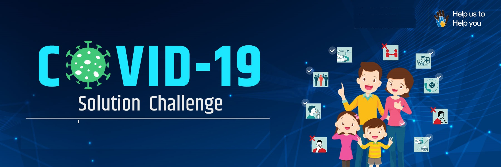
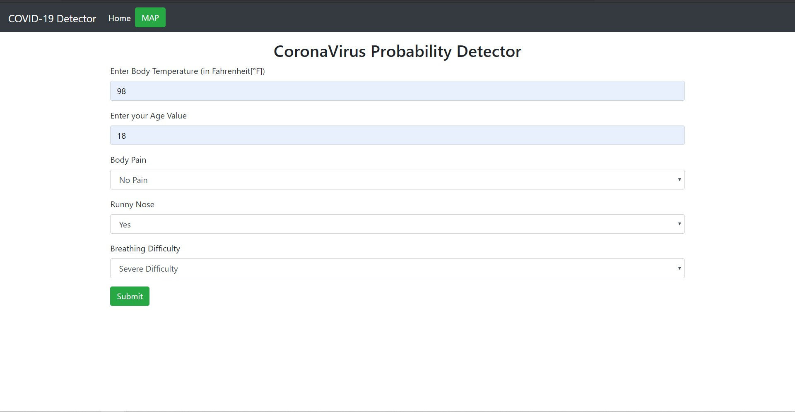
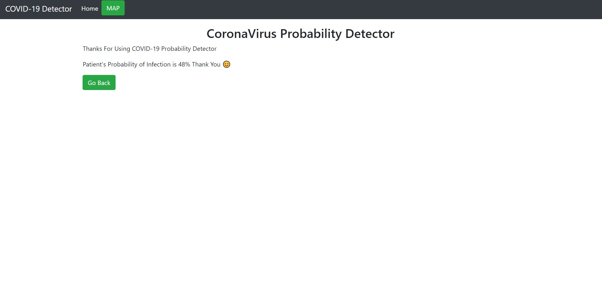
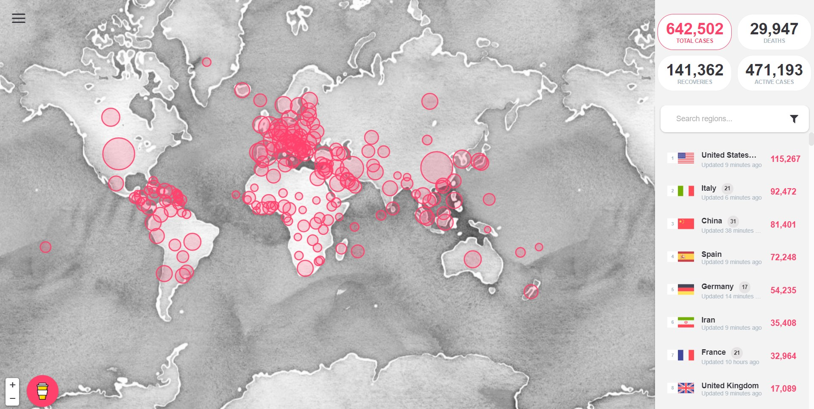

 

  

  <h3 align="center">CoronaVirus - A Programming based Solution
</h3>

## About The Project

In light of the ever-evolving Covid-19 situation.

**Presenting COVID-19 Detector**

This project is my contribution to helping to analyze the probability of a person having the infection. Technologies that were made to convert information so that it can be accessible to computers are used to aid people and I can contribute to a social cause.

COVID 19 Detector is a Web Application Prototype Developed by ME and built for Doctors to find out whom to test for the infection first under a limited testing capacity by finding out the probability of a person having the infection.

In light of the ever-evolving Covid-19 situation, This project also contains an interactive world map of the corona virus that pin-points corona-virus cases around the world. 

To aid people by providing them knowledge through a Web Application has not been done yet.

- The Objective is to Stop the transmission by prioritizing tests and hence detecting the cases quickly
- Data can be collected on the symptoms of COVID-19
- A machine learning model is then trained on the data to find out the probability of a person having the infection
- The model is then used to find out whom to test for the infection first under a limited testing capacity
- The same model can be used to find potential candidates for conducting random tests 

To aid people by providing them knowledge through a Web Application has not been done yet.

## Built With

This Web App is a dashboard developed in Flask (Python), HTML, Bootstrap/CSS and using Machine Learning. World map is created using Mapbox-Map-GL.

* 🔗 [Python](https://www.python.org/)
* 🔗 [Mapbox](www.mapbox.com)
* 🔗 [Flask](https://palletsprojects.com/p/flask/)

## 🕹 LAUNCH PROJECT
👉 [COVID 19 Detector](http://ayushman17.pythonanywhere.com/)

## Usage

The project currently a Prototype. Data to be randomly generated for this Prototype. This model uses a technique called Logistic Regression.
An HTML file will contain the UI with a form capable of sorting inferring the input data from the trained model.

## Contributing

Contributions are what make the open-source community such an amazing place to learn, inspire, and create. Any contributions you make are **extremely appreciated**.

1. Fork the Project
2. Create your Feature Branch (`git checkout -b feature/AmazingFeature`)
3. Commit your changes (`git commit -m 'Add some AmazingFeature'`)
4. Push to the Branch (`git push origin feature/AmazingFeature`)
5. Open a Pull Request

## Who made this(Author), and why?
This is made by **Ayushman Singh Chauhan (Me)**, I am a student who is interested in games, learning, and technology. Since I am a fresher, I am still learning. I am always open to learning.

## License

This project is licensed under the **MIT License** - see the [LICENSE](LICENSE) file for details

## Contact
Get in touch with Ayushman at ascb508 [at] gmail.com if you would like to contribute feedback or ideas!

